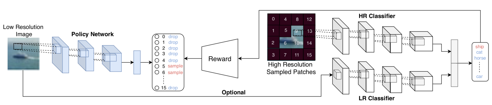
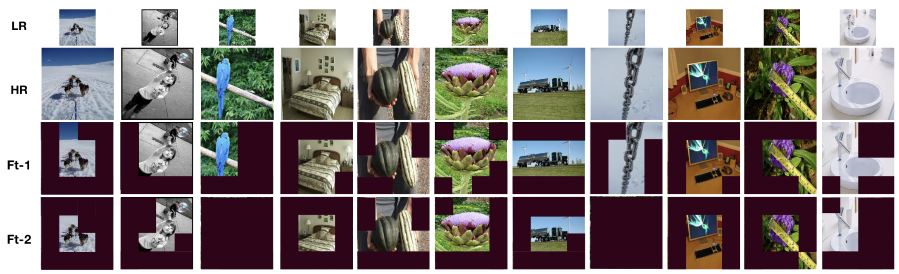
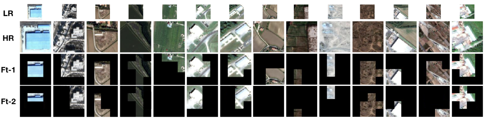

# Reimplementation of: PatchDrop - Learning When and Where to Zoom With Deep Reinforcement Learning


This repository contains implementation of a CVPR 2020 paper titled as __Learning When and Where to Zoom With Deep Reinforcement Learning__. PatchDrop proposes a reinforcement learning setup to perform conditional image sampling for the image recognition task. The goal is to use less number of image pixels when there is less ambiguity. We tried contributing to the research as a course project by changing the RL optimization algorithm used from REINFORCE to Proximal Policy Optimization, and fine-tuned a vision transformer model instead of the original CNN.

**Original Paper's Authors**: Burak Uzkent, Stefano Ermon

-------------------------------------------------------------------------------------
## Requirements
**Frameworks**: **Python3.5** and **PyTorch-v1.4.0** framework.

**Packages**: You should install prerequisites using:
```shell
  pip install -r requirements.txt
```

## Visual example of learned policies from the paper

**ImageNet**



**fMoW**



The authors' paper:
```
@inproceedings{uzkent2020learning,
  title={Learning when and where to zoom with deep reinforcement learning},
  author={Uzkent, Burak and Ermon, Stefano},
  booktitle={Proceedings of the IEEE/CVF Conference on Computer Vision and Pattern Recognition},
  pages={12345--12354},
  year={2020}
}
```
